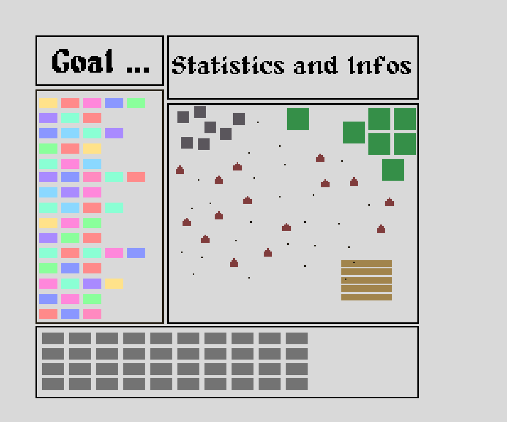
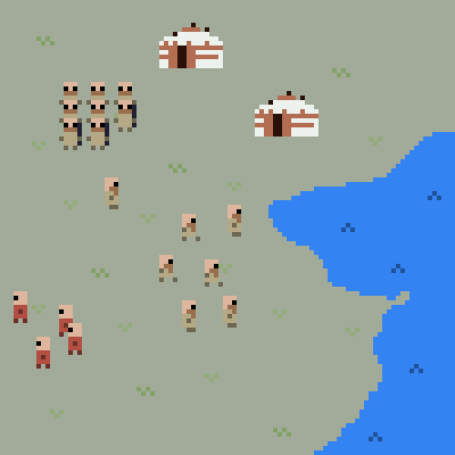
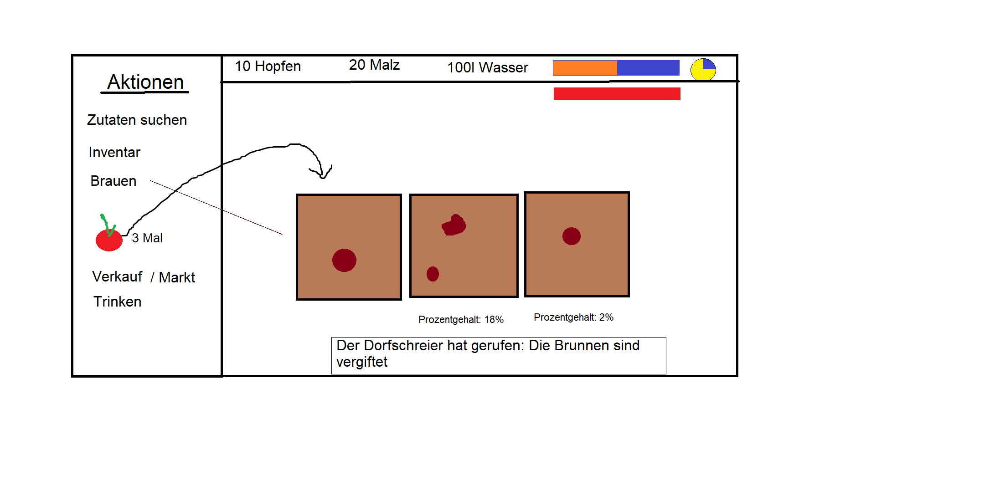
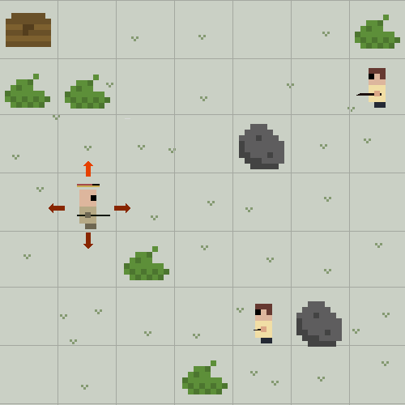

# Ideas
Important events in the 13. century: https://en.wikipedia.org/wiki/13th_century

It is important to note that the following events did not happen (or were not significant) during the 13. century:
* black death
* burning of "witches"

## The Latin Translations of a Pastor
The player is put in the role of a pastor. The pastor reads from the bible every sunday in church and translates passages. The people of the town then live by the translates phrases.
What makes this special is that the player themself decides on the translation of each word. Every week the player translates one new sentence. Depending on previous translations, however,
the player is limited on how to create translations in the following weeks.

The concept of the game is similar to "the game of life". The player makes the rules and is only limited by the set of words and their previous translations. So, you define the rules of society.

Pro
* Very creative
* Not many graphics needed

Contra
* Not limited to the 13. century
* Defining the logic of words & simulation is extremely complex and time consuming

Challenges
* What goal does the player have? In contrast to games like "Baba is You" there are no levels(?)
  * Start with different states of simulations and you have to reach some goal
  * Goal 1: create as many people as possible
  * Goal 2: Get as much money as possible
  * Goal 3: Everyone has to die
  * Goal 4: Get rid of diseases
  * ...
* Deciding on all the attributes and behaviours people of the town can have

## Genghis Khan
A mini real time strategy game in whichg Ghengis Kan takes over the world. The game is level based and each mission represents a simple historic event.

Pro
* Perfect for the 13. century
* Rather simple to implement

Contra
* Not extremely creative
* depending on sprites could become too big

## Brewery/Tavern/Inn Management
The player has the role of an owner of a brewery, tavern (and inn). Every day the player gets N action points with which they can brew beer, sell beer, manage their private life, etc. Brewing beer in this era of time can be dangerous, since you don't want to give your customers something with too little alcohol. Otherwise, bacteria could kill your customers. 
The goal is to generate a lot of revenue and improve your brewing methods.

Pro
* Simple

Contra
* Not limited to the 13. century

## The Catharian
"The Catharian" is a Rogue Like Game inspired by Hades in which the player steps into the shoes of a Catharian.

### What is Catharism?
[Catharism](https://en.wikipedia.org/wiki/Catharism) is a Christian dualist movement between the 12. and 14. century. Catharians believe in two gods:

  * An evil god (old testament): Creator of spiritual realm
  * A good god (new testament): Creator of physical world (Satan)

They regard human spirits as angels which are trapped in the physical world, destined to reincarnate (bad thing). The only way to overcome this is through [Consolamentum](https://en.wikipedia.org/wiki/Consolamentum)
This is a form of Baptism right before death. The catholic church didn't like the catharians and at one point started to kill them (inquisition).

### Gameplay
The game is a combination of strategy and real time fights.

**Movement**  
The player moves on a grid on which they can move up/down and left/right.
Each move take a little bit of time (move animation). Once arrived at the new field the player must wait some time (0.N seconds) before they can move to a next field.
This pause gets indicated by a yellow bar above the player. When it is filled up, the player can move again.

Extra: The movement speed could also depend on the amount of lifepoints left.

**Attacks**  
The player by default has some weapon. If adjacent to an enemy, the player can move on the enemy field, attack them and go back to the previous field (visualized with a short animation).
The same holds true when the enemy attacks. In case both attack at the same time the animation stops when both entities meet. Thereafter, they move back to their original field.

A player can also make use of holy magic (keys 1 - 4). Depending on which attacks are equipped, long range attacks can work, too.
Also, depending on the attack power, each attack has a cooldown.

**Level**  
Each level includes a grid with N x M fields. Each level has K enemies which all must be killed before the tplayer can proceed to the next level.

Levels might be random. However, after each Pth level a boss appears. We predefine the number and sizes of levels beforehand, so there is a final level to complete the game.

**Enemies**  
Enemies are from the Catholic church. They might use spells or melee attacks. Depending on their strength they can be named.
For example: Amalric and Milo [(Source)](https://en.wikipedia.org/wiki/Albigensian_Crusade). The final boss is Pope Innocent III. 

**Environment**  
Each level has some form of environment the player can interact with, e.g. bushes and stones. Some things can be destroyed, but this requires
additional attacks (like enemies that don't fight back).

**New Abilities after each Level**  
Clearing a level grants the player a new ability. They can choose from two random ones, each presented by one of their gods (good or evil).
New abilities could be passive or active with active ones influencing the number 1-4 Attacks. Combinations might be possible.

**Money**  
Killing enemies also grants the player money (holy coins?). They can use it to improve their general abilities:
* more lifepoints
* better spawning weapons
* decrease movement cooldown
* decrease attack cooldown

The following gif demonstrates how the gameplay could look like.

## Church in a Mafia Simulation
* Increase the number of followers
* kill everyone who stands in your way
* special events "inquisition"
* point and click game

## Bitlife + (Church + Brewery)
* combine with rogue lite/like elements
* decide which route to take: curch or catharian
* more options than in Bitlife: you should be able to do stuff
* may not be too enjoyable, but can easily be implemented in one month
* more real decisions + more transparancy what are the consequences of the player's actions

## Battles of the time
* Could be any battle, see wiki list
* tower defense or a mini strategy game

## Medieval Bitlife
* Similar to the original [Bitlife](https://bitlifeonline.com/) but in Medieval times
* Would be a highly frustrating game but an interesting learning experience

## Golden Bull
* Wikipedia definition: A golden bull was a decree issued by Byzantine Emperors and monarchs in Europe during the Middle Ages and Renaissance.
* There are multiple golden bulls, we could use the "Diploma Andreanum"
  * issued by King Andrew II of Hungary in 1224
  * granting provisional autonomy to colonial Germans residing in the region of Transylvania
* we could create a literal golden bull
* instead of being forced to issue the golden bull, Andrew II of Hungary releases a golden bull (animal)
* the bull must be caught by the player, only then the colonial Germans are granted provisional autonomy
* (other golden bulls work as well)
* the game can be a jump&run

## Building Castles
* wood and stone resource management and building game
* tower defense: for every kill you get resources/points to upgrade the castle. At one point there are too many enemies, the castle gets burned down. You loose all wood but the stones stay there. Then you have to rebuild everything
* once defeated you become the attacker or we make it more rogue like (you keep some resources for the next round)
