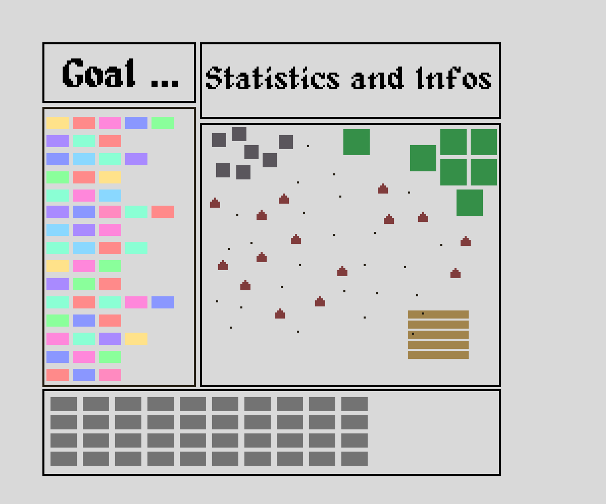

# Ideas
Important events in the 13. century: https://en.wikipedia.org/wiki/13th_century

It is important to note that the following events did not happen (or were not significant) during the 13. century:
* black death
* burning of "witches"

## The Latin Translations of a Pastor
The player is put in the role of a pastor. The pastor reads from the bible every sunday in church and translates passages. The people of the town then live by the translates phrases.
What makes this special is that the player themself decides on the translation of each word. Every week the player translates one new sentence. Depending on previous translations, however,
the player is limited on how to create translations in the following weeks.

The concept of the game is similar to "the game of life". The player makes the rules and is only limited by the set of words and their previous translations. So, you define the rules of society.

Pro
* Very creative
* Not many graphics needed

Contra
* Not limited to the 13. century
* Defining the logic of words & simulation is extremely complex and time consuming

Challenges
* What goal does the player have? In contrast to games like "Baba is You" there are no levels(?)
  * Start with different states of simulations and you have to reach some goal
  * Goal 1: create as many people as possible
  * Goal 2: Get as much money as possible
  * Goal 3: Everyone has to die
  * Goal 4: Get rid of diseases
  * ...
* Deciding on all the attributes and behaviours people of the town can have

## Brewery/Tavern/Inn Management
The player has the role of an owner of a brewery, tavern (and inn). Every day the player gets N action points with which they can brew beer, sell beer, manage their private life, etc. Brewing beer in this era of time can be dangerous, since you don't want to give your customers something with too little alcohol. Otherwise, bacteria could kill your customers. 
The goal is to generate a lot of revenue and improve your buildings.

Pro
* Simple

Contra
* Not limited to the 13. century

## (!) Church in a Mafia Simulation
* Increase the number of followers
* kill everyone who stands in your way
* special events "inquisition"
* point and click game

## (!) Catharian
* You play a catharian
* The catholic church wants to kill you
* Your goal is to evade the catholic christians as long as possible
* improve your belief and gain "holy power"
* might be a funny rogue like (or lite)

## (!) Bitlife + (Church + Brewery)
* combine with rogue lite/like elements
* decide which route to take: curch or catharian
* more options than in Bitlife: you should be able to do stuff
* may not be too enjoyable, but can easily be implemented in one month
* more real decisions + more transparancy what are the consequences of the player's actions

## Genghis Khan
A mini real time strategy game in whichg Ghengis Kan takes over the world. The game is level based and each mission represents a simple historic event.

Pro
* Perfect for the 13. century
* Rather simple to implement

Contra
* Not extremely creative
* depending on sprites could become too big

## Battles of the time
* Could be any battle, see wiki list
* tower defense or a mini strategy game

## Medieval Bitlife
* Similar to the original [Bitlife](https://bitlifeonline.com/) but in Medieval times
* Would be a highly frustrating game but an interesting learning experience

## Golden Bull
* Wikipedia definition: A golden bull was a decree issued by Byzantine Emperors and monarchs in Europe during the Middle Ages and Renaissance.
* There are multiple golden bulls, we could use the "Diploma Andreanum"
  * issued by King Andrew II of Hungary in 1224
  * granting provisional autonomy to colonial Germans residing in the region of Transylvania
* we could create a literal golden bull
* instead of being forced to issue the golden bull, Andrew II of Hungary releases a golden bull (animal)
* the bull must be caught by the player, only then the colonial Germans are granted provisional autonomy
* (other golden bulls work as well)
* the game can be a jump&run

## Building Castles
* wood and stone resource management and building game
* tower defense: for every kill you get resources/points to upgrade the castle. At one point there are too many enemies, the castle gets burned down. You loose all wood but the stones stay there. Then you have to rebuild everything
* once defeated you become the attacker or we make it more rogue like (you keep some resources for the next round)
